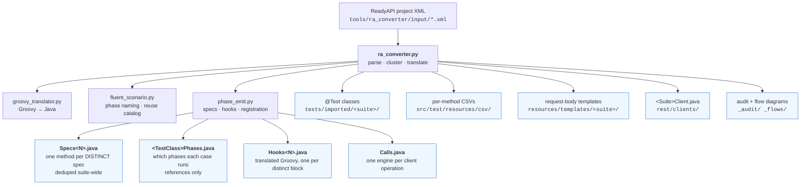
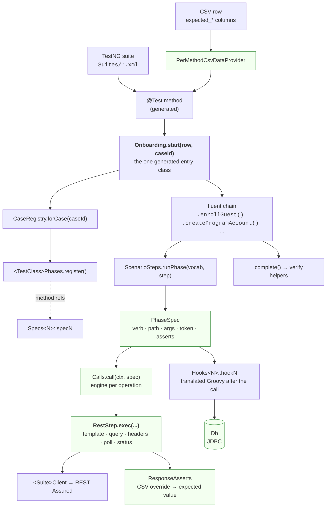

# Framework architecture

How a ReadyAPI suite becomes runnable Java, and which parts of the tree are
written by hand versus emitted by the converter.

The single most important rule when reading this repo:

> **Everything under `src/main/java/com/hi/api/support/`, `tests/imported/`,
> `src/test/resources/csv/`, `templates/`, `Suites/`, `_audit/` and `_flows/`
> is GENERATED and gitignored.** It is rewritten on every convert and must
> never be hand-edited — `--clean` deletes it.

---

## 1. Convert-time flow



## 2. Run-time flow



Green = hand-written framework. Blue = generated.

## 3. What is hand-written vs generated

| Package | Files | Kind |
|---|---|---|
| `rest/utilities/` | 12 | hand-written — `RestStep`, `RestUtilities`, `ResponseAsserts`, `AuthHelper`, `Headers` |
| `rest/utilities/phase/` | 5 | hand-written — `PhaseSpec`, `PhaseRunner`, `PhaseContext`, `CaseRegistry`, `Ref` |
| `data/` | 9 | hand-written — `PerMethodCsvDataProvider`, `PlaceholderResolver`, `Expected`, `FakeData` |
| `dsl/` | 5 | hand-written — **the manual-test surface** (see §5) |
| `db/`, `db/repo/`, `db/schema/` | 7 | hand-written |
| `domain/` (+ account/guest/member) | 4 | hand-written facades |
| `retry/`, `security/`, `schema/`, `auth/`, `config/`, `context/` | — | hand-written |
| `reporting/`, `gitlab/`, `xray/`, `meta/` | — | hand-written |
| `support/` | 7 | **generated** — incl. `ImportedScenario`, `CtxFields`, `ImportedTemplates` |
| `support/scenario/` | 1 | **generated** — `ScenarioSteps` base |
| `support/<suite>/scenario/` | 3 | **generated** — entry, suite steps base, verify helper |
| `support/<suite>/cases/` | 354 | **generated** — `Phases`, `Specs`, `Hooks`, `CaseIndex` |
| `rest/clients/` | 1 | **generated** — one client per suite |
| `templates/<suite>/` | 1 | **generated** — template constants |

`ImportedScenario` and `CtxFields` look like framework but live under
`support/` and **are emitted** — do not hand-edit them.

## 4. Two emission modes

`--phase-specs` is **on by default**. `--no-phase-specs` opts out.

| | default (phase specs) | `--no-phase-specs` |
|---|---|---|
| phases live as | data (`Specs`/`Phases`) | copied Java methods |
| entry classes | 1 (`Onboarding`) | 134, of which 101 numbered |
| `ScenarioSteps` methods | 192 (96 vocabulary names × 2) | 540 |
| per-case setup | `CaseRegistry.forCase(id)` | one class per bootstrap variant |

Compare **method counts, not line counts**. The emitter preserves
`protected Response` fields already declared in an existing
`ScenarioSteps.java` (see `_existing_scenario_steps_resp_fields`), so a
tree that has had several suites converted into it carries their fields
too. A fresh single-suite convert emits ~963 lines; this repo's tree is
1,188 because 225 fields survive from earlier suite converts. The method
count is unaffected by that and is the stable comparison.

Both modes produce the same tests, the same CSV columns and the same
TestNG suites. The default exists because numbered clones
(`Onboarding2`, `createProgramAccount104`) made the tree hard to read.

Specs are deduplicated **suite-wide**: one distinct builder becomes one
method in `Specs<N>`, referenced by every case that uses it. Doing this
per class instead cost ~18k duplicated lines.

## 5. Writing tests by hand

Hand-written tests use the **DSL**, not the generated classes:

```java
import com.hi.api.dsl.CustomerOnboarding;   // hand-written, committed
```

`com/hi/api/dsl/` is deliberately independent of converter output. As its
own javadoc puts it: `ScenarioSteps` is converter output, regenerated and
gitignored, so the DSL depends only on committed framework pieces
(`RestStep`, the domain facades, `ImportedScenario`).

**A converter run therefore cannot break hand-written tests.** Manual
tests live in `src/test/java/com/hi/api/tests/manual/` and `…/dsl/`, are
tracked in git, and are never touched by `--clean`.

## 6. Running the converter

```bash
# canonical: whole input directory, so fluent reuse is computed across
# every imported suite at once
python tools/ra_converter/ra_converter.py \
    --input tools/ra_converter/input \
    --output . --package-root com.hi.api --clean --max-name-len 40

# one suite only
python tools/ra_converter/ra_converter.py \
    --input tools/ra_converter/input/<suite>.xml \
    --output . --package-root com.hi.api --clean --max-name-len 40

# opt out of phase-spec emission
... --no-phase-specs

# framework types only, no XML -- makes a fresh clone compile so a
# hand-written test can be authored before anything is converted
python tools/ra_converter/ra_converter.py --bootstrap --output . --package-root com.hi.api
```

`--bootstrap` exists because `support/` is generated and gitignored while the
committed `dsl/`, `domain/`, `BaseApiTest` and `TokenRefresh` all reference it,
and a clone has no input XML either — so nothing compiled until something was
converted. It emits the bundled framework types plus `ImportedRestClient`,
whose signatures come from `emit_imported_rest_client()` (the same scanner a
convert uses) rather than a second hand-maintained list. With no
`fluent_catalog.json` the union degrades to exactly the committed call sites.

Guards run with `python tools/verify_all.py` (add `--full` for the Java
compile and TestNG). Note that the guard suite does **not** spawn a
converter process — it inspects source, unit-tests emitters, and builds
`Emitter` in process. Changes that only show up in a full convert need an
actual convert plus a compile as evidence.

The reverse direction does happen: a convert runs guards of its own.

| when | what runs | on failure |
|---|---|---|
| **before** emit | `test_converter_fixes.py`, `test_cross_case_contracts.py` | convert aborts, nothing written |
| **after** emit | `tools/check_ctx_dataflow.py` | convert aborts — but the tree is already written |

The dataflow check has to run after emit, because it reads the Java the run
just produced; putting it with the self-tests would grade the *previous*
convert. It catches a failure conversion itself creates — which methods a case
chains is decided by body fingerprint, so a chain can compile and run while
reading a ctx key nothing ahead of it wrote. `ctxGet` then returns `""` and the
request goes out with an empty bearer, which reads as a 401 from the
environment rather than a converter bug.

It enforces only when the triage baseline
(`<output>/tools/ctx_dataflow_baseline.json`) is reachable. Converting to a
scratch directory has no baseline there, so every already-triaged finding would
resurface as new — in that case the result is reported and the convert stands.
Opt out entirely with `--skip-dataflow-check`.
